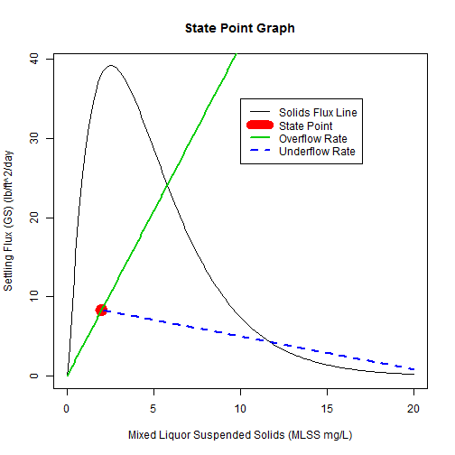
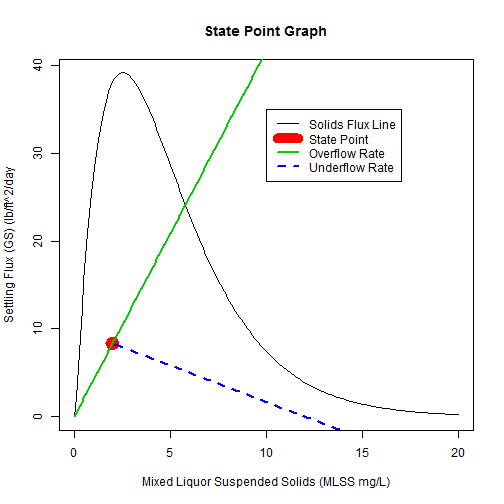

## A Good and a Bad Wastewater Operator's Fate
 
<br />Hero or Goat

--- .class #id 

## The Difference
###### Can an Operator keep his solids and bugs in the plant?
 
<br />
Bugs going out of the plant to a stream. An operator's nightmare

--- .class #id
### The Solution is to use the State Point Analysis App. 
If the green underflow line crosses the black Solids Flux Line, the Return
Activated Sludge (RAS) flow needs to be increased.  If the Red State Point is 
above the black line, you need to pull out every trick because your solids
are almost destined to go into the river. 


--- .class #id
A Bad Day

```r
Q_RAS=1
```


 

--- .class #id

RAS rate was increased, so the solids will stay in the plant.


```r
RAS_Q=1+RAS_Q
```

 


